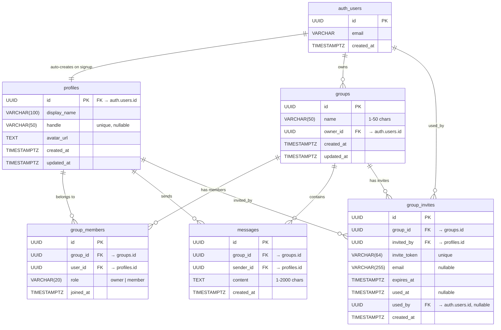

# Broseph

A group messaging app that keeps friends connected through real-time chat.

Broseph brings groups of friends together in a shared space where they can message in real time. Create a group, invite friends via magic link, and start chatting — messages sync instantly across all devices.

---

## Architecture Overview

```
┌─────────────┐     ┌─────────────┐     ┌─────────────┐
│   Frontend  │────▶│   API App   │────▶│   BullMQ    │
│   (React)   │     │  (NestJS)   │     │   (Redis)   │
└──────┬──────┘     └─────────────┘     └──────┬──────┘
       │                   │                    │
       │            ┌──────▼──────┐      ┌──────▼──────┐
       │            │  Supabase   │◀─────│   Worker    │
       └───────────▶│ (PostgreSQL)│      │  (NestJS)   │
     Realtime sub.  └─────────────┘      └─────────────┘
```

| Component | Role |
|-----------|------|
| **Frontend** | React SPA served by Vite. Sends REST requests to the API and subscribes to Supabase Realtime for live updates. |
| **API App** | NestJS HTTP server. Validates requests, enforces auth, and publishes jobs to BullMQ. Returns `202 Accepted` for write operations so the client isn't blocked. |
| **BullMQ / Redis** | Job queue. Decouples request handling from database writes so the API stays fast under load. |
| **Worker** | Separate NestJS process that consumes jobs from BullMQ and performs the actual database inserts/updates via Supabase. |
| **Supabase** | PostgreSQL database with Row Level Security, Auth (magic links + JWTs), Realtime broadcast, and file storage. |

**Why the split?** The API responds immediately while the Worker processes writes in the background. This keeps the API responsive, makes retries easy if a write fails, and lets the Worker batch or throttle operations independently.

### Monorepo Layout

| Path | What lives here |
|------|-----------------|
| `backend/apps/api/` | NestJS HTTP API |
| `backend/apps/worker/` | BullMQ job processors |
| `backend/libs/shared/` | DTOs, Zod schemas, constants, utilities |
| `frontend/src/` | React app — pages, hooks, components |
| `supabase/migrations/` | PostgreSQL schema migrations |
| `docs/` | ER diagram, dev notes, study plan |
| `milestones/` | Completed milestone retrospectives |

---

## Tech Stack

| Layer | Technology | Used for |
|-------|-----------|----------|
| **Frontend** | React 18 | UI component library |
| | TypeScript | Type-safe frontend code |
| | Vite | Dev server and production bundler |
| | Tailwind CSS | Utility-first styling |
| | HeroUI | Pre-built accessible UI components (mobile-optimized) |
| | React Query (TanStack) | Server state management, caching, infinite queries |
| | React Router v6 | Client-side routing with lazy-loaded pages |
| | Supabase JS Client | Realtime subscriptions and auth session management |
| **Backend API** | NestJS 10 | HTTP API framework (controllers, guards, modules) |
| | TypeScript | Type-safe backend code |
| | Zod | Request validation schemas |
| | BullMQ | Job queue producer (publish jobs to Redis) |
| **Background Worker** | NestJS 10 | Job processor framework |
| | BullMQ | Job queue consumer (process jobs from Redis) |
| **Database** | Supabase (PostgreSQL) | Database, Auth, Realtime, Storage |
| | Row Level Security | Per-row access control at the database layer |
| **Infrastructure** | Redis | BullMQ job queue backing store |
| | Docker Compose | Local Redis container |
| | pnpm Workspaces | Monorepo package management |

---

## Data Model



### Table Summary

| Table | Purpose | Key Constraints |
|-------|---------|-----------------|
| `profiles` | User identity (linked 1:1 to auth.users) | Auto-created on signup via trigger |
| `groups` | Chat groups | Name 1-50 chars |
| `group_members` | Junction: users ↔ groups | Unique (group_id, user_id); role: owner/member |
| `messages` | Group chat messages | Content 1-2000 chars |
| `group_invites` | Magic link group invitations | Token-based; expires after 7 days; single-use |

All tables use **Row Level Security (RLS)** — access is scoped to group membership. RLS policies use `SECURITY DEFINER` helper functions (`is_group_member`, `get_user_group_ids`) to avoid recursive policy checks.

**Storage:** An `avatars` bucket stores user profile pictures (2 MB limit; jpeg/png/gif/webp; public read).

---

## How It Works — End-to-End Feature Walkthroughs

### a. Authentication (Magic Link Flow)

Broseph uses passwordless authentication — no passwords to remember or manage. Users sign in via a magic link sent to their email.

1. **User enters email** on the login page (`/login`)
2. **Frontend calls** `POST /api/auth/magic-link` (public endpoint)
3. **API generates a magic link** using the Supabase Admin client (`adminClient.auth.admin.generateLink()`)
4. **Email is sent** containing the magic link
5. **User clicks the link** in their email
6. **Browser redirects** to `/auth/callback` with auth tokens in the URL hash
7. **`AuthCallbackPage` processes the tokens** — Supabase JS client extracts and validates them
8. **JWT session is established** — stored in the browser, sent as `Bearer` token on every API request
9. **Protected routes become accessible** — `ProtectedRoute` component checks auth state and redirects unauthenticated users to `/login`

**Key details:**
- Two Supabase clients exist on the backend: an **admin client** (service role key, bypasses RLS) for generating magic links and managing users, and a **user-scoped client** (anon key + user JWT) for operations that must respect RLS
- The frontend Supabase client persists sessions and auto-refreshes tokens
- New users who sign up via an invite link have their invite auto-accepted after account creation via a `pendingInviteAccept` flag in localStorage

### b. Group Messaging (Real-Time Flow)

Messages flow through the job queue to keep the API responsive and enable real-time delivery to all group members.

1. **User types a message** in the chat input on `GroupChatPage`
2. **Frontend fires an optimistic update** — the message appears immediately in the UI (marked `pending: true`) before the server confirms it
3. **Frontend calls** `POST /api/groups/:groupId/messages`
4. **API validates the request**, checks auth, and **publishes a job** to BullMQ → returns `202 Accepted`
5. **Worker picks up the job** and **inserts the message** into the `messages` table via Supabase
6. **Supabase Realtime broadcasts** the new row to all subscribers on the `messages` channel
7. **Frontend's `useRealtimeMessages` hook** receives the broadcast and **invalidates the React Query cache**
8. **UI updates** for all group members simultaneously

**Key details:**
- Messages use **cursor-based pagination** (50 per page) with React Query's `useInfiniteQuery` — the chat shows a "Load older messages" button at the top
- **Optimistic updates** roll back automatically if the API call fails
- The `202 Accepted` pattern means the client doesn't wait for the database write to complete

### c. Group Invites

Invites use a token-based link that works for both existing users and new sign-ups.

1. **Group member creates an invite** via `POST /api/groups/:groupId/invites`
2. **API generates a unique token** and stores it in `group_invites` with a 7-day expiry → returns `201 Created`
3. **Invite link is shared** (e.g., copied or emailed) — the link points to `/invite/:token`
4. **Recipient opens the link** → `InvitePage` calls `GET /api/invites/:token` (public) to show a **preview page** with group name and member count
5. **If the recipient is already logged in** → they click "Accept" → `POST /api/invites/:token/accept` → Worker adds them to the group → system message posted
6. **If the recipient is not logged in** → they enter their email → `POST /api/invites/:token/send-magic-link` sends a magic link → after auth callback, the invite is auto-accepted
7. **If the recipient doesn't have an account** → they sign up → `pendingInviteAccept` in localStorage triggers auto-accept after onboarding

---

## API Reference

All endpoints are prefixed with `/api`.

### Auth

| Method | Path | Auth | Sync/Queued | Description |
|--------|------|:----:|:-----------:|-------------|
| POST | `/auth/magic-link` | No | Sync | Send magic link for sign-in |
| POST | `/auth/signup-magic-link` | No | Sync | Send signup magic link with custom email |
| POST | `/auth/check-email` | No | Sync | Check if email has an existing account |
| GET | `/auth/me` | Yes | Sync | Get current user's profile |
| POST | `/auth/onboard` | Yes | Sync | Update profile during onboarding |

### Groups

| Method | Path | Auth | Sync/Queued | Description |
|--------|------|:----:|:-----------:|-------------|
| POST | `/groups` | Yes | Queued | Create a new group |
| GET | `/groups` | Yes | Sync | List current user's groups |
| GET | `/groups/:id` | Yes | Sync | Get group details with members |
| DELETE | `/groups/:id` | Yes | Queued | Delete a group (owner only, must be empty) |

### Members

| Method | Path | Auth | Sync/Queued | Description |
|--------|------|:----:|:-----------:|-------------|
| GET | `/groups/:groupId/members` | Yes | Sync | List group members |
| DELETE | `/groups/:groupId/members/me` | Yes | Queued | Leave a group |

### Messages

| Method | Path | Auth | Sync/Queued | Description |
|--------|------|:----:|:-----------:|-------------|
| POST | `/groups/:groupId/messages` | Yes | Queued | Send a message |
| GET | `/groups/:groupId/messages` | Yes | Sync | Get messages (cursor pagination: `?cursor=<id>&limit=50`) |

### Invites

| Method | Path | Auth | Sync/Queued | Description |
|--------|------|:----:|:-----------:|-------------|
| POST | `/groups/:groupId/invites` | Yes | Sync | Create an invite link |
| GET | `/invites/:token` | No | Sync | Preview invite (public) |
| POST | `/invites/:token/accept` | Yes | Queued | Accept invite and join group |
| GET | `/invites/:token/check-account` | No | Sync | Check if invite email has an account |
| POST | `/invites/:token/send-magic-link` | No | Sync | Send magic link to invite email |

### Health

| Method | Path | Auth | Sync/Queued | Description |
|--------|------|:----:|:-----------:|-------------|
| GET | `/health` | No | Sync | Service health check |

**Queued** endpoints return `202 Accepted` — the write is processed asynchronously by the Worker via BullMQ.

---

## Frontend Pages & UX

### Routes

| Path | Page | Description |
|------|------|-------------|
| `/login` | LoginPage | Email input → magic link sent for sign-in |
| `/signup` | SignUpPage | New user registration with display name |
| `/auth/callback` | AuthCallbackPage | Processes magic link tokens from URL hash |
| `/invite/:token` | InvitePage | Public invite preview; accept or sign up to join |
| `/home` | HomePage | Main feed and landing page |
| `/groups` | GroupsPage | List of user's groups with "Create Group" modal |
| `/groups/:id` | GroupChatPage | Full-screen chat with message input and infinite scroll |

### UX Notes

- **Mobile-first** — designed for small viewports with a fixed bottom tab bar for Home and Groups navigation
- **Optimistic updates** — messages appear instantly in the chat before server confirmation; rolled back on failure
- **Infinite scroll** — chat messages load in pages of 50 via cursor pagination with a "Load older messages" trigger
- **Real-time** — Supabase Realtime subscriptions push new messages and member changes to all connected clients
- **Dark mode** — supported via Tailwind's `darkMode: 'class'` and HeroUI's theme system
- **Lazy-loaded pages** — route-level code splitting via React.lazy for faster initial load

---

## Security Model

### Two-Layer Access Control

Broseph enforces access at **two independent layers** — if either layer blocks a request, the operation fails.

| Layer | Mechanism | Scope |
|-------|-----------|-------|
| **API Guards** | `SupabaseAuthGuard` on NestJS controllers | Validates JWT Bearer token; attaches user context to request |
| **Database RLS** | Row Level Security policies on every table | PostgreSQL enforces per-row access based on `auth.uid()` and group membership |

### Two Supabase Client Types

| Client | Key Used | When Used | RLS Behavior |
|--------|----------|-----------|--------------|
| **Admin** | Service role key | Magic link generation, user lookup, Worker DB writes | **Bypasses RLS** — used for operations that act on behalf of the system |
| **User-scoped** | Anon key + user JWT | Profile reads/updates, any operation that should be user-restricted | **Respects RLS** — database enforces that the user can only access their own data and groups |

### Business Limits

| Constraint | Value |
|------------|-------|
| Max members per group | 10 |
| Max groups per user | 20 |
| Max message length | 2,000 characters |
| Max group name length | 50 characters |
| Invite link expiry | 7 days |
| Avatar file size | 2 MB |
| Avatar formats | jpeg, png, gif, webp |

Limits are defined in `backend/libs/shared/src/constants/limits.ts` and enforced in both Zod validation schemas (API layer) and database constraints (migration layer).

---

## Project Structure

```
broseph/
├── package.json                        # Root workspace config
├── pnpm-workspace.yaml                 # Workspace definition (backend, frontend)
├── docker-compose.yml                  # Redis container for BullMQ
├── CLAUDE.md                           # Development context guide
│
├── backend/                            # NestJS monorepo
│   ├── nest-cli.json                   # NestJS CLI config
│   ├── tsconfig.json                   # Path aliases (@app/shared)
│   │
│   ├── apps/
│   │   ├── api/                        # HTTP API (port 3000)
│   │   │   └── src/
│   │   │       ├── auth/               # Magic link auth, guards, decorators
│   │   │       ├── groups/             # Group CRUD
│   │   │       ├── messages/           # Send & list messages
│   │   │       ├── members/            # Group membership
│   │   │       ├── invites/            # Token-based invite links
│   │   │       └── email/              # Email service
│   │   │
│   │   └── worker/                     # BullMQ job processor
│   │       └── src/
│   │           ├── job.processor.ts    # Main job dispatcher
│   │           └── handlers/           # Per-job-type handlers
│   │
│   └── libs/
│       └── shared/                     # Shared across API & Worker
│           └── src/
│               ├── dto/                # Data Transfer Objects
│               ├── schemas/            # Zod validation schemas
│               ├── constants/          # Limits and configuration
│               ├── supabase/           # Supabase service & module
│               └── utils/              # Helper utilities
│
├── frontend/                           # React + Vite SPA
│   ├── vite.config.ts
│   ├── tailwind.config.js
│   └── src/
│       ├── pages/                      # One file per route
│       │   ├── HomePage.tsx
│       │   ├── GroupsPage.tsx
│       │   ├── GroupChatPage.tsx
│       │   ├── LoginPage.tsx
│       │   ├── SignUpPage.tsx
│       │   ├── AuthCallbackPage.tsx
│       │   └── InvitePage.tsx
│       ├── components/                 # Feature-organized UI components
│       │   ├── chat/                   # MessageList, MessageBubble, ChatHeader
│       │   ├── groups/                 # GroupCard, CreateGroupModal
│       │   ├── navigation/            # BottomTabNav, MainLayout
│       │   ├── members/               # Member list & management
│       │   ├── invites/               # Invite flow components
│       │   └── profile/               # Profile display & editing
│       ├── hooks/                      # React Query hooks
│       │   ├── useMessages.ts          # Infinite query for chat messages
│       │   ├── useSendMessage.ts       # Optimistic send with rollback
│       │   ├── useRealtimeMessages.ts  # Supabase Realtime subscription
│       │   ├── useGroups.ts            # Group list query
│       │   └── ...                     # Auth, invites, members hooks
│       ├── contexts/
│       │   └── AuthContext.tsx          # Auth state provider
│       └── lib/
│           └── supabase.ts             # Supabase client initialization
│
├── supabase/
│   ├── config.toml                     # Local Supabase config
│   ├── seed.sql                        # Seed data
│   └── migrations/                     # Sequential schema migrations
│       ├── ..._initial_schema.sql
│       ├── ..._profiles.sql
│       ├── ..._groups.sql
│       ├── ..._messages.sql
│       ├── ..._invites.sql
│       ├── ..._fix_rls_recursion.sql
│       ├── ..._enable_realtime.sql
│       └── ..._avatar_storage.sql
│
├── docs/                               # Documentation
│   ├── dev-notes.md                    # Local setup guide
│   ├── er-diagram.md                   # Entity relationship diagram
│   └── study-plan.md
│
└── milestones/                         # Completed feature retrospectives
    ├── 001-project-bootstrap.md
    ├── 002-initial-auth-setup.md
    ├── 003-mvp-group-messaging.md
    ├── ...
    └── 011-prompts-feature-phase1.md
```

---

## Screenshots

> Screenshots coming soon as the project progresses.

---

## Local Development

For local setup instructions, see [`docs/dev-notes.md`](docs/dev-notes.md).
