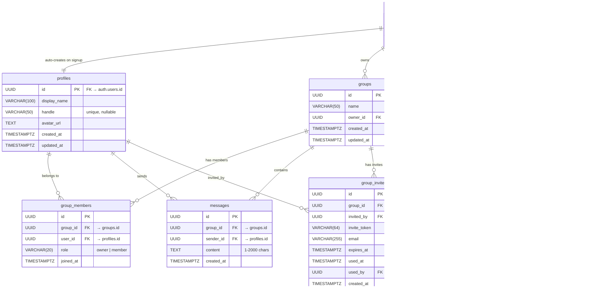

# Broseph ER Diagram

> Auto-generated from Supabase migrations. Update when schema changes.

## Table Summary

| Table | Purpose | Key Constraints |
|-------|---------|-----------------|
| `profiles` | User identity (linked 1:1 to auth.users) | Auto-created on signup via trigger |
| `groups` | Chat groups | Name 1-50 chars |
| `group_members` | Junction: users ↔ groups | Unique (group_id, user_id); role: owner/member |
| `messages` | Group chat messages | Content 1-2000 chars |
| `group_invites` | Magic link group invitations | Token-based; expires; single-use |
| `prompt_responses` | Daily conversation prompt answers | Unique (group_id, user_id, response_date) |

## Storage Buckets

| Bucket | Purpose | Limits |
|--------|---------|--------|
| `avatars` | User profile pictures | 2 MB; jpeg/png/gif/webp; public read |

## Notes

- All tables use **Row Level Security (RLS)** — access scoped to group membership
- RLS uses `SECURITY DEFINER` helper functions (`is_group_member`, `get_user_group_ids`) to avoid recursive policy checks
- `messages` and `group_members` are published to **Supabase Realtime** for live updates
- `profiles.id` = `auth.users.id` — the same UUID, not a separate sequence
